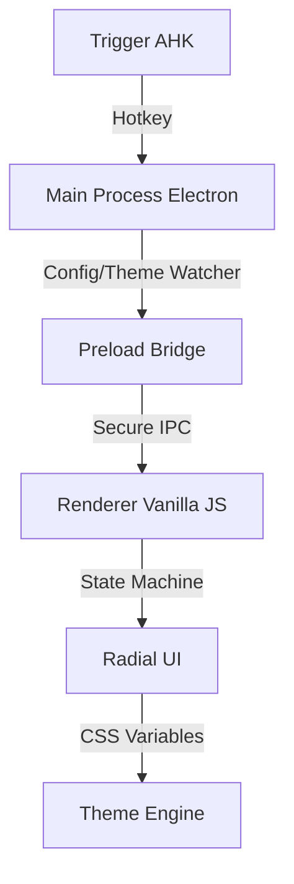

# <p align="center">🪐 Orbit Premium</p>

<p align="center">
  
</p>

<p align="center">
  <b>A high-performance, aesthetically-driven radial launcher for Windows 11.</b><br>
  Built with Electron, Vanilla JS, and Liquid Glass CSS.
</p>

---

## 🚀 Overview

Orbit is a minimalist control hub designed to replace cluttered desktops and taskbars. It provides instant access to your tools through a responsive, state-aware radial menu that lives entirely in your muscle memory.

<p align="center">
  
</p>

### 🏗️ Architecture



---

## ✨ Features

- **🎯 Precision Centering**: Always launches exactly at your cursor position.
- **🌀 Liquid Glass UI**: Immersive dark-glass aesthetic with zero-interference click-through.
- **📁 Nested Groups**: Organize unlimited apps and commands into logical orbits.
- **🎨 Pro-Grade Themes**: Swappable HSL-tailored themes (Neon, Frost, Cyber, Glass).
- **🛠️ Dynamic Icon System**: Auto-generates sleek letter-glyphs if SVGs are missing.
- **🚀 Ultra-Low Latency**: Performance-optimized DOM strategy for <100ms reveal.
- **🔊 Spatial Audio**: Haptic-style sonic feedback for every interaction.

---

## 🛠️ Setup & Deployment

### 1. Prerequisites

- [Node.js LTS](https://nodejs.org/)
- [AutoHotkey v2](https://www.autohotkey.com/)

### 2. Installation

```powershell
npm install
```

### 3. Usage

1. Run `orbit-trigger.ahk` to enable the system-wide hotkey.
2. Press **Middle Mouse Button** (default) to summon the Orbit.
3. **Double Click** center for settings; **Right Click** center to add custom apps.
4. **Right Click** anywhere else to navigate back/close.

### 4. Build Production

```powershell
npm run build
```

---

## ⚙️ Configuration

Customize Orbit via `config.json`:

| Property      | Description                 | Default     |
| ------------- | --------------------------- | ----------- |
| `hotkey`      | Any valid AHK hotkey        | `MButton`   |
| `radius`      | Distance from center        | `100`       |
| `activeTheme` | Selected visual profile     | `Dark Neon` |
| `devMode`     | Performance & State Overlay | `false`     |

---

## 🧠 Core Engineering

Orbit was developed with a multi-agent architectural focus:

- **UI Orchestration**: Advanced state machine handling (IDLE/ACTIVE/COLLAPSING).
- **System Integrity**: File system watchers with debouncing and graceful fallbacks.
- **Security**: Zero-Node renderer boundary via secure Context Bridge.
- **UX**: Proximity-based scaling and parallax effects for a "living" interface.

---

## 📄 License

This project is licensed under the MIT License - see the [LICENSE](LICENSE) file for details.

---

<p align="center">
  Developed with ❤️ for the Windows Enthusiast.
</p>
