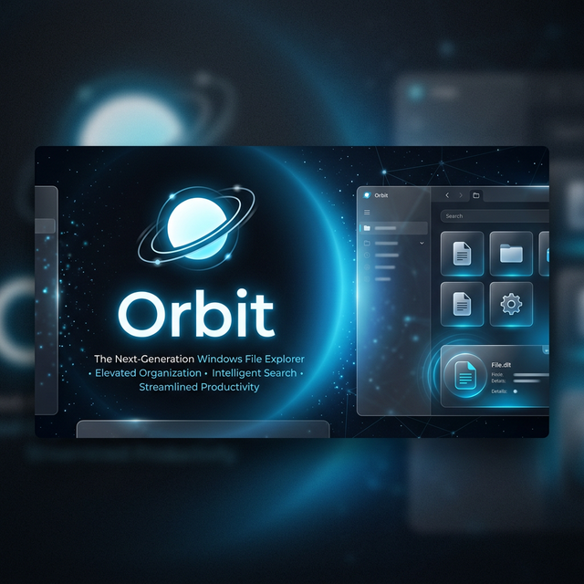
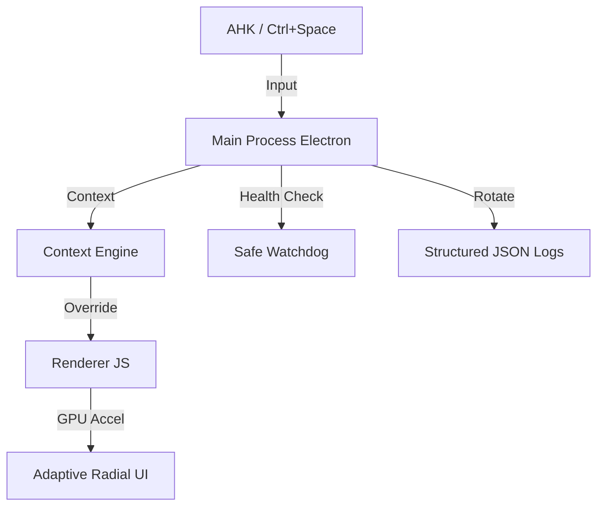

# <p align="center">🪐 Orbit 2.0 — Anti-Gravity</p>

<p align="center">
  
</p>

<p align="center">
  <b>A Contextual OS Augmentation Layer for Windows.</b><br>
  Elevated with Intelligence, Hybrid Input, and Mission-Critical Safety.
</p>

---

## 🚀 Orbit 2.0: The Elevation

Orbit 2.0 is not just a launcher; it's a **contextual intelligence hub**. It adapts to your workflow, learns your system state, and provides ultra-fast navigation via hybrid mouse/keyboard interaction.

### 🏗️ 2.0 Architecture



---

## ✨ 2.0 Features

- **🧠 Contextual Intelligence**: Automatically adapts radial actions based on the active application (e.g., Browser vs VS Code).
- **⚡ Command Palette**: Hybrid keyboard mode invoked via `Ctrl+Space` with fuzzy search.
- **🎮 Gesture Recognition**: Fast-swipe during reveal for instant action triggering.
- **🚀 GPU Optimized**: Animations powered by hardware-accelerated CSS layers (`will-change`).
- **🛡️ Self-Healing Runtime**: background Watchdog and Heartbeat system for auto-recovery.
- **🔒 Sandboxed Plugin API 2.0**: Secure, contract-based extension platform.
- **📊 Structured Telemetry**: JSON-based logging with auto-rotation (5MB limit).
- **🎯 Algorithmic Layout**: Dynamic icon scaling and angular collision avoidance for 5 to 50+ items.

---

## 🛠️ Setup & Deployment

### 1. Prerequisites

- [Node.js LTS](https://nodejs.org/)
- [AutoHotkey v2](https://www.autohotkey.com/)

### 2. Installation

```powershell
npm install
```

### 3. Usage

1. Run `orbit-trigger.ahk` for middle-click trigger.
2. Press **Ctrl + Space** for the Command Palette.
3. **Swipe** mouse fast during expand to trigger gestures.
4. **Right Click** icons for the Icon Management suite.

---

## 🧠 Mission-Critical Engineering

Orbit 2.0 is built for **Enterprise-Grade Stability**:

- **Strict FSM**: Enforced state transitions (`idle -> expanding -> active -> collapsing`) reject illegal race conditions.
- **Atomic Persistence**: Config migration and writes are fully atomic with `fsync` sync-to-disk.
- **Performance Budget**: Real-time monitoring logs errors if reveal animations exceed **120ms**.
- **Security**: Strict IPC whitelisting, BrowserWindow sandboxing, and whitelisted execution paths.

---

## 📄 License

MIT License.

---

<p align="center">
  Developed with ❤️ for the Windows Enthusiast.
</p>
