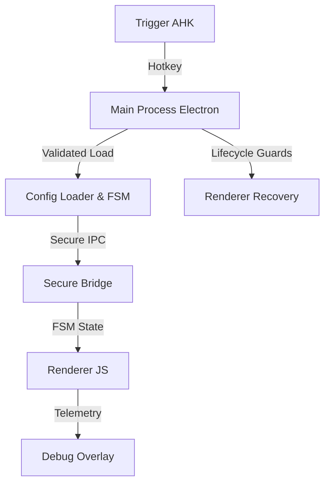

# <p align="center">🪐 Orbit Premium</p>

<p align="center">
  
</p>

<p align="center">
  <b>A high-performance, aesthetically-driven radial launcher for Windows 11.</b><br>
  Built with Electron, Vanilla JS, and Liquid Glass CSS.
</p>

---

## 🚀 Overview

Orbit is a minimalist control hub designed to replace cluttered desktops and taskbars. It provides instant access to your tools through a responsive, state-aware radial menu that lives entirely in your muscle memory.

<p align="center">
  
</p>

### 🏗️ Architecture



---

## ✨ Features

- **🎯 Precision Centering**: Always launches exactly at your cursor position.
- **🛡️ Hardened Stability**: Finite State Machine (FSM) prevents state desyncs and spam.
- **🔒 Atomic Writes**: Config safety with `fsync` and temp-file strategies.
- **📁 Nested Groups**: Organize unlimited apps and commands into logical orbits.
- **🎨 Pro-Grade Themes**: Swappable HSL-tailored themes.
- **🛠️ Dynamic Icon System**: Auto-generates sleek letter-glyphs if SVGs are missing.
- **🚀 Secure Execution**: Whitelisted path resolution for apps and commands.
- **� Real-time Telemetry**: Debug panel for live state and coordinate tracking.

---

## 🛠️ Setup & Deployment

### 1. Prerequisites

- [Node.js LTS](https://nodejs.org/)
- [AutoHotkey v2](https://www.autohotkey.com/)

### 2. Installation

```powershell
npm install
```

### 3. Usage

1. Run `orbit-trigger.ahk` to enable the system-wide hotkey.
2. Press **Middle Mouse Button** (default) to summon the Orbit.
3. **Double Click** center for settings; **Right Click** center for Icon Management.
4. **Right Click** on icons to delete, nest, or move them.

---

## ⚙️ Configuration

Customize Orbit via `config.json`:

| Property      | Description                   | Default     |
| ------------- | ----------------------------- | ----------- |
| `hotkey`      | Any valid AHK hotkey          | `MButton`   |
| `radius`      | Distance from center          | `140`       |
| `activeTheme` | Selected visual profile       | `Dark Neon` |
| `devMode`     | Telemetry & State Overlay     | `false`     |
| `appVersion`  | Internal migration versioning | `1.0.0`     |

---

## 🧠 Core Engineering

Orbit's architecture is built for mission-critical reliability:

- **State Integrity**: A robust Finite State Machine (IDLE/EXPANDING/ACTIVE/COLLAPSING) ensures smooth transitions.
- **Crash Recovery**: Renderer processes feature a 3-retry auto-reload guard with tray notifications.
- **Data Safety**: Config is validated via `Ajv` schema and saved atomically with disk synchronization.
- **Security**: Strict IPC whitelisting and whitelisted path resolution for all custom actions.
- **Monitoring**: Persistent file logging (`orbit.log`) and baseline-relative memory tracking.

---

## 📄 License

This project is licensed under the MIT License - see the [LICENSE](LICENSE) file for details.

---

<p align="center">
  Developed with ❤️ for the Windows Enthusiast.
</p>
