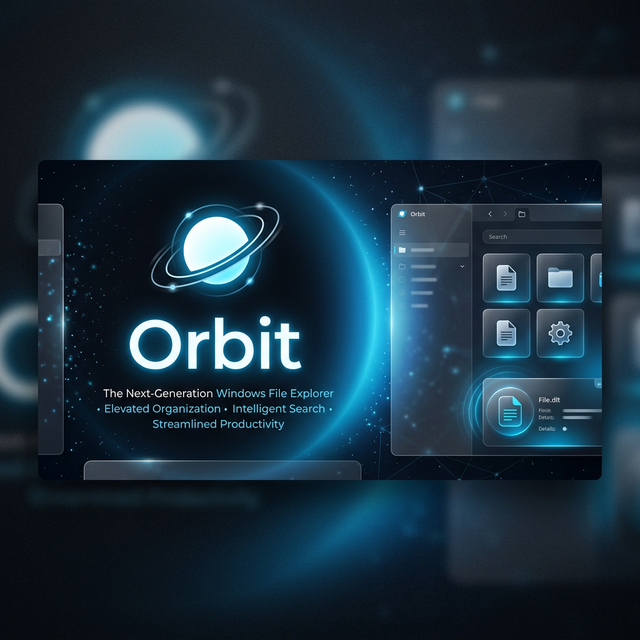
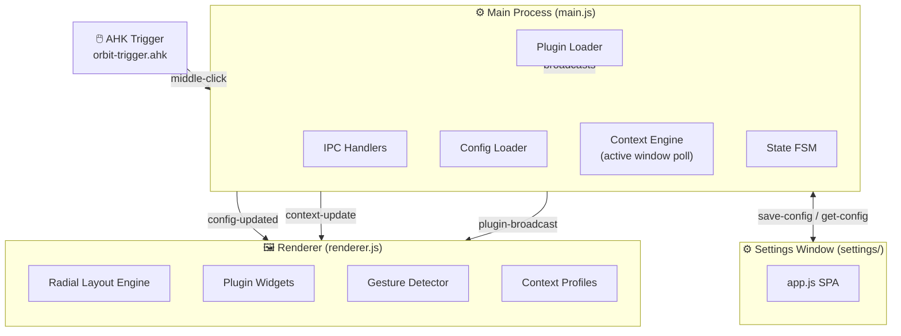

<div align="center">



<br/>

<h1>🪐 Orbit</h1>

<p><strong>A contextual radial launcher and OS augmentation layer for Windows</strong></p>

<p>
  
  
  
  
</p>

<p>
  <a href="https://github.com/Harsha754-ml/Orbit/releases/latest">
    
  </a>
  &nbsp;
  <a href="https://github.com/Harsha754-ml/Orbit/releases/latest">
    
  </a>
</p>

<br/>

> Middle-click anywhere → your entire workflow at your fingertips.
> Context-aware. Plugin-powered. Zero friction.

</div>

---

## 📋 Table of Contents

- [What is Orbit?](#-what-is-orbit)
- [Features](#-features)
- [Installation](#-installation)
- [First Launch](#-first-launch)
- [Using Orbit](#-using-orbit)
- [Settings App](#️-settings-app)
- [Plugins](#-plugins)
- [Context Profiles](#-context-profiles)
- [Gesture Shortcuts](#-gesture-shortcuts)
- [Themes](#-themes)
- [Building from Source](#-building-from-source)
- [Project Structure](#-project-structure)
- [Architecture](#-architecture)
- [License](#-license)

---

## 🌌 What is Orbit?

Orbit is a **radial launcher** that lives in your system tray and appears instantly wherever your cursor is. Instead of hunting through taskbars and start menus, you get a circular menu of your most-used actions — right where you're already looking.

**It's not just a launcher:**
- 🧠 **Context-aware** — different actions appear automatically depending on which app is in focus
- 🔌 **Plugin-powered** — 12 built-in plugins add real-time widgets (system monitor, Pomodoro, weather, clipboard history, and more)
- 👆 **Gesture shortcuts** — fast-swipe in any direction to trigger actions instantly, without opening the menu
- ⚙️ **Full settings app** — configure everything through a dedicated UI, no config file editing required

---

## ✨ Features

<table>
<tr>
<td width="50%">

### 🎯 Core
- Radial menu with multi-ring layout (scales to 50+ items)
- Adaptive positioning — never goes off-screen
- GPU-accelerated animations (60 FPS)
- Middle-click trigger (configurable)
- Command palette with fuzzy search (`Ctrl+Space`)
- Self-healing watchdog with auto-recovery

</td>
<td width="50%">

### 🔌 Plugins (12 built-in)
- System Monitor — live CPU & RAM
- Clipboard History — last 10 entries
- Quick Notes — floating notepad
- Media Controller — play/pause/volume
- Pomodoro Timer — focus sessions
- Weather — live conditions (no API key)
- App Switcher — focus any open window
- Snippets — paste saved text anywhere
- Window Snapper — 10 snap positions
- Script Runner — run scripts with live output
- Recent Files — quick file access
- Focus Mode — auto-kill distracting apps

</td>
</tr>
<tr>
<td>

### 🧠 Intelligence
- Context Profiles — per-app action injection
- Active window detection (VS Code, Chrome, etc.)
- Gesture shortcuts (swipe Up/Down/Left/Right)
- Profile-aware radial — prepends relevant actions

</td>
<td>

### 🛡️ Stability
- Strict FSM (idle → expanding → active → collapsing)
- Atomic config writes with fsync
- IPC channel whitelist enforcement
- Sandboxed plugin API with contextBridge
- JSON structured logs with 5MB auto-rotation

</td>
</tr>
</table>

---

## 💿 Installation

### Option A — Installer (Recommended)

> ✅ Best for most users. Installs to AppData, creates Start Menu shortcut, registers auto-start.

1. Go to the [**Latest Release**](https://github.com/Harsha754-ml/Orbit/releases/latest)
2. Download **`Orbit-2.0.1-Setup-x64.exe`**
3. Run the installer — it's a one-click silent install
4. Orbit launches automatically after install
5. Look for the **🪐 icon in your system tray**

> **No AutoHotkey installation required.** The AHK v2 runtime is bundled inside the installer.

---

### Option B — Portable

> ✅ No install needed. Run from any folder, USB drive, etc.

1. Download **`Orbit-2.0.1-Portable-x64.exe`** from [Releases](https://github.com/Harsha754-ml/Orbit/releases/latest)
2. Double-click to run
3. Orbit starts and adds itself to your system tray

---

### Option C — Build from Source

See [**Building from Source**](#-building-from-source) below.

---

## 🚀 First Launch

When Orbit starts for the first time:

| Step | What happens |
|------|-------------|
| **1** | Orbit window opens (transparent, fullscreen, always-on-top) |
| **2** | The bundled AHK trigger (`orbit-trigger.ahk`) launches automatically |
| **3** | Orbit and the trigger are registered in Windows startup (`HKCU\Run`) |
| **4** | A tray icon appears — right-click it to access Settings and other options |

**To verify it's working:**
Middle-click anywhere on your desktop or in a browser → the radial menu should appear at your cursor.

---

## 🖱️ Using Orbit

### Opening the Menu

| Action | Result |
|--------|--------|
| **Middle-click** | Opens the radial menu at cursor |
| **Middle-click again / Right-click / Esc** | Closes the menu |
| **Ctrl + Space** | Opens the command palette (keyboard search) |

### Navigating

| Action | Result |
|--------|--------|
| **Hover** an item | Shows label, highlights item |
| **Left-click** an item | Executes the action |
| **Left-click** a group (📁) | Expands into sub-menu ring |
| **Scroll wheel** | Adjusts the menu radius live |

### Gesture Shortcuts

Swipe your mouse **faster than 250ms over 80px** in any direction while the menu is open:

| Gesture | Direction |
|---------|-----------|
| ↑ Swipe Up | Configurable action |
| ↓ Swipe Down | Configurable action |
| ← Swipe Left | Configurable action |
| → Swipe Right | Configurable action |

Configure gestures in **Settings → Gesture Shortcuts**.

---

## ⚙️ Settings App

Open the Settings window by **right-clicking the tray icon → Settings**.

<table>
<tr><th>Page</th><th>What you can do</th></tr>
<tr>
  <td>🏠 <strong>Dashboard</strong></td>
  <td>Live stats (action count, active plugins, current theme), quick toggles, plugin overview</td>
</tr>
<tr>
  <td>⚡ <strong>Actions</strong></td>
  <td>Add, edit, delete, and nest actions into groups. Full tree editor with drag support</td>
</tr>
<tr>
  <td>🔌 <strong>Plugins</strong></td>
  <td>View all loaded plugins, their version and status. Open the plugins folder</td>
</tr>
<tr>
  <td>🎯 <strong>Context Profiles</strong></td>
  <td>Create per-app profiles. Actions automatically prepend to your radial when that app is focused</td>
</tr>
<tr>
  <td>👆 <strong>Gestures</strong></td>
  <td>Assign any action to Up / Down / Left / Right swipe directions</td>
</tr>
<tr>
  <td>🎨 <strong>Themes</strong></td>
  <td>Preview and apply visual themes (Dark Neon, Dracula, Solarized, Forest, Sunset, Monochrome)</td>
</tr>
<tr>
  <td>🔧 <strong>General</strong></td>
  <td>Radius, animation speed, hover labels, sound effects, gesture toggle, hotkey</td>
</tr>
</table>

> All changes **auto-save** and apply to the live radial immediately.

---

## 🔌 Plugins

Plugins live in the `plugins/` folder. Drop a `.js` file in and restart Orbit — it loads automatically.

### Built-in Plugins

<table>
<tr><th>Plugin</th><th>Widget</th><th>Actions added to radial</th></tr>
<tr><td>🖥️ <strong>System Monitor</strong></td><td>CPU%, RAM used/total, uptime</td><td>Toggle widget</td></tr>
<tr><td>📋 <strong>Clipboard History</strong></td><td>Last 10 clipboard entries, click to re-copy</td><td>Toggle widget</td></tr>
<tr><td>📝 <strong>Quick Notes</strong></td><td>Floating notepad synced to a .txt file</td><td>View Notes, Edit Notes</td></tr>
<tr><td>🎵 <strong>Media Controller</strong></td><td>Now playing info</td><td>Play/Pause, Next, Prev, Vol+/−, Mute</td></tr>
<tr><td>🍅 <strong>Pomodoro</strong></td><td>25-min countdown, break timer</td><td>Start Focus, Pause, Reset</td></tr>
<tr><td>🌤️ <strong>Weather</strong></td><td>Live conditions, temp, humidity, wind</td><td>Toggle widget</td></tr>
<tr><td>🪟 <strong>App Switcher</strong></td><td>All open windows, click to focus</td><td>Toggle widget</td></tr>
<tr><td>✂️ <strong>Snippets</strong></td><td>—</td><td>Paste any saved snippet into the active app</td></tr>
<tr><td>📐 <strong>Window Snapper</strong></td><td>—</td><td>Left/Right/Top/Bottom half, 4 corners, Fullscreen, Center 80%</td></tr>
<tr><td>⚡ <strong>Script Runner</strong></td><td>Live stdout output</td><td>Run any saved PowerShell/cmd script</td></tr>
<tr><td>📂 <strong>Recent Files</strong></td><td>—</td><td>Dynamic list of recently opened files</td></tr>
<tr><td>🚫 <strong>Focus Mode</strong></td><td>Status + blocklist</td><td>Enable/Disable focus, auto-kills distracting apps</td></tr>
</table>

### Installing a Custom Plugin

```
1. Drop your .js plugin file into the  plugins/  folder
2. Restart Orbit
3. The plugin loads automatically on startup
```

Or open Settings → Plugins → **📁 Open Folder** to navigate there directly.

---

## 🎯 Context Profiles

Context profiles let you **automatically inject actions** into your radial based on which app is in focus.

### Built-in profiles

| App | Injected actions |
|-----|-----------------|
| **VS Code** (`code.exe`) | New Terminal, Git Status, Git Push, Format (Alt+Shift+F) |
| **Chrome** (`chrome.exe`) | New Tab, Dev Tools, Incognito |
| **Edge** (`msedge.exe`) | New Tab, Dev Tools |
| **Explorer** (`explorer.exe`) | Terminal Here, New Folder |

### Adding your own profile

1. Open **Settings → Context Profiles**
2. Click **+ Add Profile**
3. Enter the process name (e.g. `figma.exe`, `slack.exe`)
4. Add actions to the profile
5. Focus that app — your actions appear automatically

---

## 👆 Gesture Shortcuts

Gestures fire **instantly** without opening the radial menu. Just swipe fast in any direction anywhere on screen.

**Configure in Settings → Gestures:**

```
↑  Up    →  e.g. Open Terminal
↓  Down  →  e.g. Show Desktop
←  Left  →  e.g. Previous Track
→  Right →  e.g. Next Track
```

**Trigger threshold:** >80px movement in <250ms

---

## 🎨 Themes

Orbit includes 6 built-in themes. Switch from **Settings → Themes** — applies instantly.

| Theme | Accent | Background |
|-------|--------|------------|
| **Dark Neon** | `#00bfff` | `#0a0a1a` |
| **Dracula** | `#bd93f9` | `#282a36` |
| **Solarized** | `#268bd2` | `#002b36` |
| **Forest** | `#98c379` | `#1a2318` |
| **Sunset** | `#e06c75` | `#1f1a1b` |
| **Monochrome** | `#aaaaaa` | `#111111` |

---

## 🔧 Building from Source

### Prerequisites

- [Node.js 20 LTS](https://nodejs.org/) or newer
- [Git](https://git-scm.com/)
- Windows 10/11 x64

> AutoHotkey is **not required** to build — the runtime is downloaded as part of the release process.

### Steps

```bash
# 1. Clone the repository
git clone https://github.com/Harsha754-ml/Orbit.git
cd Orbit

# 2. Install dependencies
npm install

# 3. Run in development mode
npm start
```

### Build the installer

```bash
# Builds both NSIS installer and portable exe → dist/
npm run dist
```

Output files in `dist/`:
```
Orbit-2.0.1-Setup-x64.exe      ← Installer
Orbit-2.0.1-portable.exe       ← Portable
Orbit-2.0.1-win-x64.exe.blockmap
```

### Development tips

```bash
# Run without building
npm start

# The settings window opens from tray → Settings
# Config is read/written from config.json in the project root
# Plugins hot-reload is not supported — restart after adding plugins
```

---

## 📁 Project Structure

```
orbit/
│
├── main.js                  ← Electron main process, IPC handlers, AHK manager
├── preload.js               ← contextBridge for the radial overlay window
├── settings-preload.js      ← contextBridge for the settings window
├── defaultConfig.json       ← Default configuration (copied to config.json on first run)
├── themes.json              ← Theme definitions
├── orbit-trigger.ahk        ← AutoHotkey v2 trigger script
│
├── src/
│   ├── index.html           ← Radial overlay UI
│   ├── renderer.js          ← All radial UI logic, plugin widgets, gesture detection
│   └── styles.css           ← Overlay styles
│
├── settings/
│   ├── index.html           ← Settings app HTML (7-page SPA)
│   ├── app.js               ← Settings app logic
│   └── styles.css           ← Settings app styles
│
├── lib/
│   ├── configLoader.js      ← Atomic config read/write
│   ├── contextEngine.js     ← Active window polling
│   ├── executor.js          ← Safe action execution
│   ├── logger.js            ← Structured JSON logger
│   ├── pluginLoader.js      ← Plugin loader and API
│   ├── state.js             ← FSM state manager
│   └── windowUtils.js       ← Cursor position helpers
│
├── plugins/
│   ├── system-monitor.js
│   ├── clipboard-history.js
│   ├── quick-notes.js
│   ├── media-controller.js
│   ├── pomodoro.js
│   ├── weather.js
│   ├── app-switcher.js
│   ├── snippets.js
│   ├── window-snapper.js
│   ├── script-runner.js
│   ├── recent-files.js
│   └── focus-mode.js
│
└── assets/
    ├── icon.png             ← App icon (PNG)
    ├── icon.ico             ← App icon (ICO, multi-size)
    └── AutoHotkey64.exe     ← Bundled AHK v2 runtime (not in git, added at build time)
```

---

## 🏗️ Architecture


```mermaid
graph TD
    AHK["🖱️ AHK Trigger\norbit-trigger.ahk"] -->|middle-click| Main

    subgraph Main ["⚙️ Main Process  (main.js)"]
        direction TB
        IPC["IPC Handlers"]
        CFG["Config Loader"]
        CTX["Context Engine\n(active window poll)"]
        PL["Plugin Loader"]
        FSM["State FSM"]
    end

    Main -->|config-updated| Renderer
    Main -->|context-update| Renderer
    Main -->|plugin-broadcast| Renderer

    subgraph Renderer ["🖼️ Renderer  (renderer.js)"]
        direction TB
        RADIAL["Radial Layout Engine"]
        WIDGETS["Plugin Widgets"]
        GESTURES["Gesture Detector"]
        PROFILES["Context Profiles"]
    end

    subgraph Settings ["⚙️ Settings Window  (settings/)"]
        SAPP["app.js SPA"]
    end

    Main <-->|save-config / get-config| Settings
    PL -->|broadcasts| Main
```

### Key design decisions

| Decision | Reason |
|----------|--------|
| `contextIsolation: true` + `sandbox: true` | Renderer cannot access Node APIs directly — all communication via contextBridge |
| IPC channel whitelist | Only pre-approved channel names are accepted in main process |
| Atomic config writes | `writeConfigSafe` uses temp file + rename to prevent corruption |
| FSM for menu state | Prevents illegal state transitions and race conditions |
| AHK bundled, not required | Users don't need to install AHK — the runtime ships with Orbit |
| Plugins in main process | Plugins can use Node APIs, spawn processes, use the filesystem safely |

---

## 🛠️ Tray Menu Reference

| Item | Action |
|------|--------|
| **Show Orbit** | Trigger the radial menu at the center of the screen |
| **Settings** | Open the Settings window |
| **Restart AHK Trigger** | Kill and relaunch the AHK process (useful if the trigger stops working) |
| **Quit** | Cleanly shut down Orbit and the AHK trigger |

---

## ❓ Troubleshooting

<details>
<summary><strong>Middle-click doesn't open the menu</strong></summary>

1. Check the tray icon is present — if not, relaunch Orbit
2. Right-click tray → **Restart AHK Trigger**
3. Make sure you're clicking on the **desktop** or a **browser** (with Ctrl held if `requireCtrlInBrowsers` is enabled)
4. Check `orbit.log` in the install directory for errors

</details>

<details>
<summary><strong>Menu appears but actions don't execute</strong></summary>

1. Open **Settings → Actions** and verify the action has a command set
2. For `cmd` type actions, test the command in PowerShell first
3. Check `orbit.log` for `action_failed` entries

</details>

<details>
<summary><strong>Plugins not loading</strong></summary>

1. Open **Settings → Plugins → 📁 Open Folder**
2. Make sure your `.js` file is directly in the `plugins/` folder (not a subfolder)
3. Restart Orbit after adding a plugin
4. Check `orbit.log` for plugin load errors

</details>

<details>
<summary><strong>Settings window won't open</strong></summary>

Right-click the tray icon → Settings. If nothing happens, fully quit and relaunch Orbit.

</details>

<details>
<summary><strong>How do I change the trigger from middle-click to something else?</strong></summary>

1. Open **Settings → General → Hotkey**
2. Change the value (e.g. `MButton`, `XButton1`, `F13`)
3. Click **Save Changes**
4. Right-click tray → **Restart AHK Trigger** to apply

</details>

---

## 📄 License

MIT — see [LICENSE](LICENSE) for full text.

---

<div align="center">

Built for Windows power users who hate clicking through menus.

<br/>

⭐ **Star this repo** if Orbit saves you time every day.

</div>
